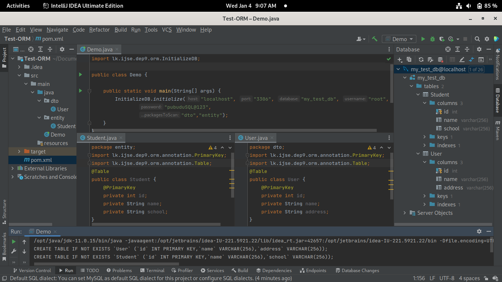

# Simple ORM framework 

### A simple object–relational mapping framework

This is a simple framework that creates a relational database system and 
maps given classes inside packages into database tables.

This framework only works with the **MySQL** relational database management system.

#### The mapping of classes to database tables is as follows,

- @Table annotation must be used over the class name to create the database table. The name of the database table is the class name.
- @PrimaryKey annotation must be used over the one instance field in the class to create the table's primary key.
- The column names of the database tables are matched to the instance field names of the class.
- Database tables can be created with only using instance variables.

#### Supported data types in the framework,
- String -> VARCHAR(256)
- int -> INT
- Integer -> INT
- double -> DOUBLE(10,2)
- Double -> DOUBLE(10,2)
- BigDecimal -> DECIMAL(10,2)
- Date -> DATE
- Time -> TIME

The goal of this project was to improve the knowledge of java annotations and java reflection API.

## Used Technologies

- Java SE 11
- Apache Maven 3.8.6
- Added dependencies to pom.xml
    - mysql-connector-j 8.0.31
    - junit-jupiter-api 5.8.2
    - junit-jupiter-engine 5.8.2

#### Used Integrated Development Environment
- IntelliJ IDEA

## How to use ?
This project can be used by cloning the
project to your local computer.

1. Clone the project using `git clone https://github.com/PubuduJ/simple-orm-framework.git` terminal command.
2. Open the `pom.xml` file from **IntelliJ IDEA**, make sure to open this as a project.
3. To install this framework to local jar repository execute `mvn install` command.
4. Once the framework is installed in local JAR repository, it can be used with any Java project.
5. Inorder to use the framework add below dependency to your Java project pom.xml file.
    ```
        <dependency>
            <groupId>lk.ijse.dep9</groupId>
            <artifactId>simple-orm</artifactId>
            <version>1.0.2</version>
        </dependency>
   ```
6. call the `InitializeDB.initialize()` method in the source code by passing the correct arguments.
7. `InitializeDB.initialize()` method requires host, port, database name, username, password and package list to scan as String arguments.

## Sample usage of the framework

The scanning packages in the example are dto and entity, and tables are automatically built for the User and Student classes inside those packages.



## Credits
This project was carried out under the guidance of the [IJSE](https://www.ijse.lk/) Direct Entry Program 9.

## Version
v1.0.2

## License
Copyright &copy; 2023 [Pubudu Janith](https://www.linkedin.com/in/pubudujanith94/). All Rights Reserved.<br>
This project is licensed under the [MIT license](LICENSE.txt).